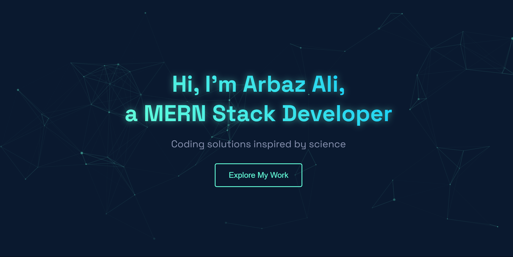

# Portfolio Website 🚀

## Overview
A modern, interactive portfolio website showcasing my projects and skills. Built with HTML, CSS, and JavaScript, featuring smooth animations and a responsive design.

## Features ✨
- **Interactive UI**: Engaging user interface with smooth transitions and animations
- **Project Showcase**: Dynamic project cards with hover effects and detailed descriptions
- **Skills Section**: Visual representation of technical skills and competencies
- **Contact Form**: Interactive contact form with validation and success animations
- **Lab-themed Contact Section**: Creative flask-style social media links
- **Responsive Design**: Fully responsive layout that works on all device sizes

## Technologies Used 🛠️
- HTML5
- CSS3
- JavaScript
- Custom Animations
- Responsive Design

## Interactive Elements 🎯
- Animated project cards with 3D transformations
- Lab-themed contact section with bubbling animations
- Smooth scrolling navigation
- Form validation with visual feedback
- Success animation on form submission

## Connect With Me 🤝
- [Email](mailto:arbaz130803@gmail.com)
- [GitHub](https://github.com/arbaz-codehub)
- [LinkedIn](https://www.linkedin.com/in/arbaz-ali-884a68330/)

## Getting Started 🚀
1. Clone the repository
2. Open `index.html` in your browser
3. Explore the portfolio!

## License 📝
This project is open source and available under the [MIT License](LICENSE).
